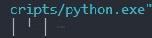
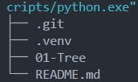
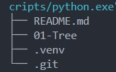
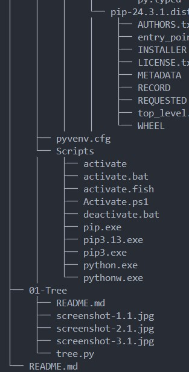
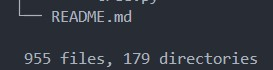
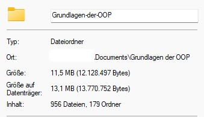

# Aufgabe 1 - Tree-Funktion

Die Datei [tree.py](tree.py) implementiert eine rekursive Version des "tree"-Befehls.
Die Verzeichniseinträge und Unterverzeichnisse werden mit Unicode-Symbolen dargestellt und alphabetisch Sortiert.
Als Ergänzung beinhaltet die Ausgabe die Zählung aller Verzeichnisse und Dateien.

## Teil a) - Einfache Ausgabe

Zuerst habe ich die Zeichen in meiner Funktion deklariert und mir die Symbole in der Console angeschaut:

```python
def print_directory(path):
    # Unicode-Zeichen
    TEE = chr(9500)  # ├
    ELBOW = chr(9492)  # └
    VERT = chr(9474)  # │
    DASH = chr(9472)  # ─
    print(TEE, ELBOW, VERT, DASH)

print_directory(".")
```

<details>
<summary>Console</summary>



</details>

Danach habe ich os.scandir() implementiert und musste es erstmal mit "import os" importieren. Ich wollte mit einer For schleife durch die einzelnen Verzeichnisse iterieren und diese dann mit den symbolen zusammen ausgeben (beim letzten symbol dann "ELBOW" und 2x "DASH" + name in jeder iteration). Ich habe dann jedoch einen Error: "TypeError: object of type 'nt.ScandirIterator' has no len()" erhalten. Das lag daran weil der ScandirIterator ein Objekt ausgibt und es nicht die methode len() unterstützt. Als Lösung habe ich das Object dann einfach vor der Schleife in eine liste umgewandelt mit "list()".

```python
import os

def print_directory(path):
    # Unicode-Zeichen
    TEE = chr(9500)  # ├
    ELBOW = chr(9492)  # └
    VERT = chr(9474)  # │
    DASH = chr(9472)  # ─

    with os.scandir(path) as entries:
        entries = list(entries)
        for i, entry in enumerate(entries):
            connector = TEE if i < len(entries) - 1 else ELBOW
            print(f"{connector}{DASH*2} {entry.name}")

print_directory(".")
```

<details>
<summary>Console</summary>



</details>

Zuletzt wurde mein Code mit der Zeile "entries = sorted(entries, key=lambda f: f.name.lower())" erweiter um sicherzustellen, dass es auch Sortiert wird. Leider kann ich das nur schlecht veranschaulichen, weil meine IDE die Dateien automatisch sortiert deswegen zeige ich es mit dem parameter Reverse: True:

```python
import os

def print_directory(path):
    # Unicode-Zeichen
    TEE = chr(9500)  # ├
    ELBOW = chr(9492)  # └
    VERT = chr(9474)  # │
    DASH = chr(9472)  # ─

    with os.scandir(path) as entries:
        # iterator in Liste Umwandeln
        entries = list(entries)
        # liste sortieren
        entries = sorted(entries, key=lambda f: f.name.lower(), reverse=True)
        for i, entry in enumerate(entries):
            connector = TEE if i < len(entries) - 1 else ELBOW
            print(f"{connector}{DASH*2} {entry.name}")

if __name__ == "__main__":
    print_directory(".")
```

<details>
<summary>Console</summary>



</details>

## Teil b) - Erweiterung mit Rekursion und Einrückung

Zuerst wurde die Funktion print_directory mit

```python
def print_directory(path, indentation_level=0):
```

erweiter.

Danach habe ich das Print statement zu folgendem abgeändert:

```python
print(f"{'    ' * indentation_level}{connector}{DASH*2} {entry.name}")
```

Zuletzt habe ich noch am Ende der Schleife folgendes angefügt:

```python
# Wenn weiteres Directory wiederhole print_directory (rekursiv)
if entry.is_dir():
    print_directory(entry.path, indentation_level + 1)
```

Nun ist mir aufgefallen das mir der Vertikale Strich fehlt und dass ich diesen ja nur Anzeigen will wenn ich in einem Unter-Verzeichnis bin also habe ich folgende logik eingebaut und das Print Statement angepasst:

```python
# Einrückung mit │ nur bei level > 0
if indentation_level > 0:
    indent = (VERT + "    ") * indentation_level
else:
    indent = "    " * indentation_level

print(f"{indent}{connector}{DASH*2} {entry.name}")
```

Der Komplette Code und die Consolen augabe sehen nun so aus:

```python
import os


def print_directory(path, indentation_level=0):
    # Unicode-Zeichen
    TEE = chr(9500)  # ├
    ELBOW = chr(9492)  # └
    VERT = chr(9474)  # │
    DASH = chr(9472)  # ─

    with os.scandir(path) as entries:
        # iterator in Liste Umwandeln
        entries = list(entries)
        # liste sortieren
        entries = sorted(entries, key=lambda f: f.name.lower(), reverse=False)
        for i, entry in enumerate(entries):
            connector = TEE if i < len(entries) - 1 else ELBOW

            # Einrückung mit │ nur bei level > 0
            if indentation_level > 0:
                indent = (VERT + "    ") * indentation_level
            else:
                indent = "    " * indentation_level

            print(f"{indent}{connector}{DASH*2} {entry.name}")

            # Wenn weiteres Directory wiederhole print_directory (rekursiv)
            if entry.is_dir():
                print_directory(entry.path, indentation_level + 1)


if __name__ == "__main__":
    print_directory(".")
```

<details>
<summary>Console</summary>



</details>

## Teil c) - Ergänzung der Ausgabe mit Zählung

Da ein Zähler zurückgegeben werden soll, füge ich Zwei Zähler in die Funktion ein:

```python
n_files = 0
n_dirs = 0
```

Nun brauche ich eine Logik, welche bei jedem neuen Verzeichnis die Zählungen auf die Zähler addiert und wenn es kein Verzeichnis ist einfach die datei Addiert. Dazu erweitere ich meine If entry.is_dir() logik:

```python
# Wenn weiteres Directory wiederhole print_directory (rekursiv)
if entry.is_dir():
    # dieses Verzeichnis mitzählen
    n_dirs += 1
    #rekursiv Unterzählungen holen
    child_files, child_dirs = print_directory(entry.path, indentation_level + 1)
    n_files += child_files
    n_dirs += child_dirs
else:
    #Dateien zählen
    n_files += 1
```

Durch ein return statement kann ich den touple dann am ende zurückgeben:

```python
return n_files, n_dirs
```

Zuletzt muss ich noch die Rückgabe anpassen sodass es in der Console auch angezeigt wird.

```python
if __name__ == "__main__":
    files, dirs = print_directory(".")
    print(f"\n {files} files, {dirs} directories")
```

Ich habe die Rückgabewerte mit den Tatsächlichen werten verglichen und es hat gestimmt. Zuletzt noch der gesamte Code mit Consolen rückgabe.

```python
import os


def print_directory(path, indentation_level=0):
    # Unicode-Zeichen
    TEE = chr(9500)  # ├
    ELBOW = chr(9492)  # └
    VERT = chr(9474)  # │
    DASH = chr(9472)  # ─

    n_files = 0
    n_dirs = 0

    with os.scandir(path) as entries:
        # iterator in Liste Umwandeln
        entries = list(entries)
        # liste sortieren
        entries = sorted(entries, key=lambda f: f.name.lower(), reverse=False)
        for i, entry in enumerate(entries):
            connector = TEE if i < len(entries) - 1 else ELBOW

            # Einrückung mit │ nur bei level > 0
            if indentation_level > 0:
                indent = (VERT + "    ") * indentation_level
            else:
                indent = "    " * indentation_level

            print(f"{indent}{connector}{DASH*2} {entry.name}")

            # Wenn weiteres Directory wiederhole print_directory (rekursiv)
            if entry.is_dir():
                # dieses Verzeichnis mitzählen
                n_dirs += 1
                # rekursiv Unterzählungen holen
                child_files, child_dirs = print_directory(
                    entry.path, indentation_level + 1
                )
                n_files += child_files
                n_dirs += child_dirs
            else:
                # Dateien zählen
                n_files += 1

    return n_files, n_dirs


if __name__ == "__main__":
    files, dirs = print_directory(".")
    print(f"\n {files} files, {dirs} directories")

```

<details>
<summary>Console + Überprüfung</summary>

 

</details>
