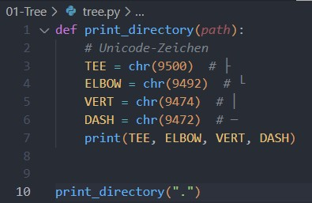
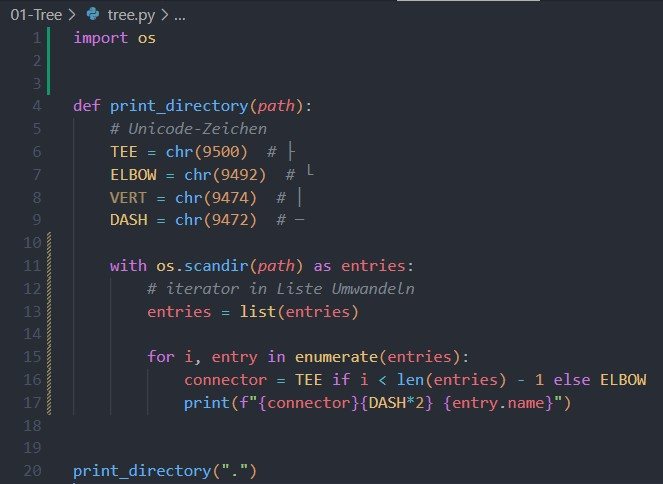
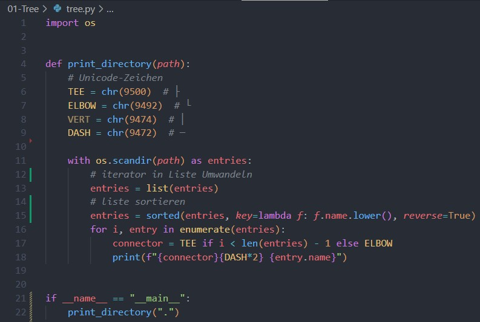

# Aufgabe 1 - Tree-Funktion

## Teil a) - Einfache Ausgabe

Die Datei [tree.py](tree.py) implementiert eine vereinfachte Version des "tree"-Befehls.
Die Verzeichniseinträge werden mit Unicode-Symbolen dargestellt und alphabetisch Sortiert.

Zuerst habe ich die Zeichen in meiner Funktion deklariert und mir die Symbole in der Console angeschaut:

<details>
<summary>📂 Code-Auszug anzeigen</summary>

```python
def print_directory(path, indentation_level=0):
```

</details>

 

Danach habe ich os.scandir() implementiert und musste es erstmal mit "import os" importieren. Ich wollte mit einer For schleife durch die einzelnen Verzeichnisse iterieren und diese dann mit den symbolen zusammen ausgeben (beim letzten symbol dann "ELBOW" und 2x "DASH" + name in jeder iteration). Ich habe dann jedoch einen Error: "TypeError: object of type 'nt.ScandirIterator' has no len()" erhalten. Das lag daran weil der ScandirIterator ein Objekt ausgibt und es nicht die methode len() unterstützt. Als Lösung habe ich das Object dann einfach vor der Schleife in eine liste umgewandelt mit "list()".

 

Zuletzt wurde mein Code mit der Zeile "entries = sorted(entries, key=lambda f: f.name.lower())" erweiter um sicherzustellen, dass es auch Sortiert wird. Leider kann ich das nur schlecht veranschaulichen, weil meine IDE die Dateien automatisch sortiert deswegen zeige ich es mit dem parameter Reverse: True:

 

## Teil b) - Erweiterung mit Rekursion und Einrückung
