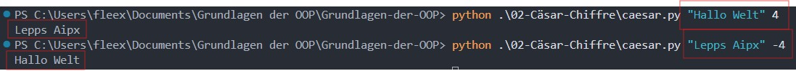

# Aufgabe 2 - Cäsar-Chiffre

Die Datei [caesar.py](caesar.py) implementiert

## Teil a) - Verschlüsselung, Entschlüsselung und Konsolen Aufruf mit Parameter check.

Zuerst habe ich die Funktion encode_text erstellt und und geschaut ob ich einen Text als parameter aufspalten und dann in einer Liste wieder zusammenführen kann, damit ich später jeden buchstaben um 3 stellen verschieben kann.

```python
def encode_text(text, key):
    result = []

    # schleife die den text verschlüsselt
    for ch in text:
        result.append(ch)

    return "".join(result)


print(encode_text("Hallo welt", 3))
```

Nun möchte ich für jeden Buchstaben erkennen ob es ein Großbuchstabe oder Kleinbuchstabe ist und ihn um 3 Buchstaben verschieben.Dafür muss ich eigentlich nur den Index herausfinden und dann 3 addieren. Um den Index herauszufinden wandle ich zuerst den Buchstaben in ASCII um, und ziehe dann das ASCII vom ersten Buchstaben im Alphabet also "A" bei groß und "a" bei klein ab. Dann addiere ich den Key also die verschiebung hinzu und erhalte somit den Index für meinen Verschlüsselten Buchstaben, darauf wende ich den Modulo 26 an damit nach Z wieder A kommt. Nun muss ich nurnoch auf die Basis den Index Addieren und es mit chr() von ASCII in den Buchstaben wandeln und ihn dann meiner Ergebnis liste Anhängen.

```python
 # schleife die den text verschlüsselt
for ch in text:
    if ch.isupper():
        base = ord("A")
        offset = (ord(ch) - base + key) % 26  # modulo 26 damit nach Z wieder A
        result.append(chr(base + offset))
    elif ch.islower():
        base = ord("a")
        offset = (ord(ch) - base + key) % 26
        result.append(chr(base + offset))
    else:
        result.append(ch)
```

Zuletzt erstelle ich die Mainfunktion und Importiere sys um auf die console zu zugreifen. Zuerst überprüfe ich ob die länge der parameter auch < 3 ist und dann erstelle ich zwei Variablen mit den Parametern aus der Konsolen eingabe um mit ihnen die Funktion auszuführen in einem Print statement:

```python
def main():
    if len(sys.argv) < 3:
        print("Fehler: Bitte Text und Schlüssel angeben.")
        print(' python ceasar.py "Das ist ein Text" 3')
        sys.exit(1)

    text = sys.argv[1]
    key = int(sys.argv[2])

    print(encode_text(text, key))
```

Hier ist mein Ganzer code und als Beweis mein Konsolen Output:

```python
import sys


def encode_text(text, key):
    result = []

    # schleife die den text verschlüsselt
    for ch in text:
        if ch.isupper():
            base = ord("A")
            offset = (ord(ch) - base + key) % 26  # modulo 26 damit nach Z wieder A
            result.append(chr(base + offset))
        elif ch.islower():
            base = ord("a")
            offset = (ord(ch) - base + key) % 26
            result.append(chr(base + offset))
        else:
            result.append(ch)  # sonderzeichen bleiben unverändert

    return "".join(result)


def main():
    if len(sys.argv) < 3:
        print("Fehler: Bitte Text und Schlüssel angeben.")
        print(' python ceasar.py "Das ist ein Text" 3')
        sys.exit(1)

    text = sys.argv[1]
    key = int(sys.argv[2])

    print(encode_text(text, key))


if __name__ == "__main__":
    main()
```

<details>
<summary>Console</summary>



</details>
